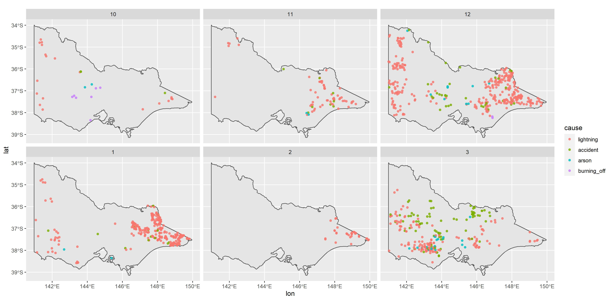

```{r setup, include=FALSE}
knitr::opts_chunk$set(echo = FALSE, message = FALSE, warning = FALSE)
library(tidyverse)
Sys.setlocale("LC_ALL","English")
```

```{r titleslide, child="components/titleslide.Rmd"}
```

---
# 🗺️ Introduction

<h2>👨‍🚒2019-2020 Australia bushfire season👩‍🚒</h2>

<div class="grid" style="grid: 1fr / 2fr 2fr;">

<div>


<br>
<br>


</div>
<div class="item">

<br>

<br>

<br>

<ul>
<li>A catastrophic and unprecedented disaster.</li>
<li>3094 houses were destroyed, 17M hectares of land burned and 33 lives were lost. </li>
</ul>
</div>


</div>


<!-- .footnote[https://www.boredpanda.com/home-destroyed-wildfire-pig-charlie/?utm_source=pinterestm&utm_medium=referral&utm_campaign=organic] -->


---
# 🗺️ Introduction


<h2>⚡  Lightning or 🔥Arson?</h2>


<!-- https://twitter.com/MRobertsQLD/status/1220588928706568193 -->
---
# 🗺️ Introduction
## 📡 Remote sensing data

**Remote sensing data** are the reflected energy from the earth collected by remote sensors carried by a satellite or an aircraft. 

Japan Aerospace Exploration Agency  provides a hotspot product taken from the **Himawari-8** satellite.

```{r}
if (!file.exists("images/hotspots_before.png")){
  library(rnaturalearth)
  library(ggthemes)
  library(lubridate)
  au_map <- ne_states(country = 'Australia', returnclass = 'sf')
  vic_map <- au_map[7,]
  VIC_hotspots_before_clustering <- read_csv("data/VIC_hotspots_before_clustering.csv")
  
  p <- ggplot(VIC_hotspots_before_clustering) +
    geom_sf(data = vic_map) +
    geom_point(aes(lon, lat), size = 3) +
    theme_map()
  
  ggsave(p, filename = "images/hotspots_before.png", height = 8, width = 12, dpi = 600)
}


```

```{r}
if (!file.exists("images/hotspots_before_summary.png")){
  library(rnaturalearth)
  library(ggthemes)
  library(lubridate)
  au_map <- ne_states(country = 'Australia', returnclass = 'sf')
  vic_map <- au_map[7,]
  VIC_hotspots_before_clustering <- read_csv("data/VIC_hotspots_before_clustering.csv")
  p <- VIC_hotspots_before_clustering %>%
  mutate(date = as.Date("2019-10-01") + hours(time_id)) %>%
  group_by(date = floor_date(date, unit = "days")) %>%
  count() %>%
  mutate(date = as.Date(date)) %>%
  ggplot() +
  geom_bar(aes(date, n), stat = "identity") +
  theme_minimal(base_size = 40) +
  ylab("Count (Log 10)") +
  xlab("Date") +
  ggtitle("Number of hotspots") +
  scale_x_date(date_labels = "%b %y") +
  scale_y_log10()

  ggsave(p, filename = "images/hotspots_before_summary.png", height = 8, width = 12, dpi = 600)
}


```


---
class: middle center
## 🎯 Research questions

.monash-blue[(1) Can we detect **bushfire ignitions** from hotspot data?]
 
.monash-blue[(2) Can we accurately predict the **causes** of bushfires during the 2019-2020 Australia bushfire season?]

---
# 📚 Literature review

**Loboda and Csiszar (2007)**

* Fire Spread Reconstruction (**FSR**)
* Clustered hotspots in a temporal manner to detect the bushfire ignitions

**Read, Duff, and Taylor (2018)**: 


* Fitted a logistic regression generalised additive model to lightning-caused ignitions  in Victoria
* Used weather conditions, vegetation types, topographic information and environmental impact of human activities as covariates

<br>

.font_my_2[**Others**: Ester et al. (1996), Zhang, Lim, and
Sharples (2017), Zumbrunnen et al. (2012)]
---
# 📂 Data
## Data Sources

.monash-red2[**🔥 Historical fire origins**]: .font_my_2[Department of Environment, Land, Water and Planning]

.monash-red2[**📡 Remote sensing data**]: .font_my_2[Japan Aerospace Exploration Agency]

### Supplementary

.font_my[
**Wind speed data**: .font_my_2[Commonwealth Scientific and Industrial Research Organisation and Automated Surface Observing System]

**Temperature, Rainfall and Solar exposure**:  .font_my_2[Bureau of Meteorology]

**Road map**: .font_my_2[OpenStreetMap]

**Fuel layer**: .font_my_2[Australian Bureau of Agricultural and Resource Economics]

**Fire stations and Recreation sites**: .font_my_2[Department of Environment, Land, Water and Planning]
]


---

# 🔬 Methodology

## Diagram


---
# 💻 Data wrangling
## Detect bushfire ignitions from hotspot data

.font_my[
We developd a spatio-temporal clustering algorithm to track bushfires from noisy satellite hotspot data.
]

--

1️⃣ Divide hotspots into different blocks
.font_my_2[
$$[max(t-24, 1), t], t = 1,2,...,T~(hours)$$
]

--

2️⃣ Cluster hotspots in each block

.font_my_2[
* Connect two nodes if geodesic between two nodes <= 3km.
* A connected component is a cluster.
]

--

3️⃣ Update the clustering results recursively

.font_my_2[
* Start from the second hour, till the end.
* If a hotspot is also in the last hour block, update its membership. And then hotspots who share the component with it will also be updated.
]

--

4️⃣ Compute ignition locations

---
# 💻 Data wrangling
## Clustering result

```{r}
if (!file.exists("images/hotspots_after.png")){
  library(rnaturalearth)
  library(ggthemes)
  library(lubridate)
  au_map <- ne_states(country = 'Australia', returnclass = 'sf')
  vic_map <- au_map[7,]
  VIC_hotspots_before_clustering <- read_csv("data/VIC_hotspots_before_clustering.csv")
  VIC_hotspots_after_clustering <- read_csv("data/VIC_hotspots_after_clustering.csv")
  hotspots <- read_csv("data/VIC_hotspots_raw.csv")
  
  VIC_hotspots_before_clustering$fire_id <- VIC_hotspots_after_clustering$fire_id
  VIC_hotspots_before_clustering$date <- hotspots$`#obstime`
  
  VIC_hotspots_after_clustering <- VIC_hotspots_before_clustering %>%
    group_by(fire_id) %>%
    summarise(time_id = min(time_id)) %>%
    left_join(VIC_hotspots_before_clustering) %>%
    group_by(fire_id, time_id) %>%
    summarise(lon = mean(lon), lat = mean(lat), date = mean(date))
  
  p <- ggplot(VIC_hotspots_after_clustering) +
    geom_sf(data = vic_map) +
    geom_point(aes(lon, lat), alpha = 0.8, size = 2) +
    theme_map()
  
  ggsave(p, filename = "images/hotspots_after.png", height = 7, width = 12, dpi = 600) 
}

```


<!--  -->

---
# 💻 Data wrangling
## Clustering result

```{r}
if (!file.exists("images/hotspots_after_summary.png")){
  library(rnaturalearth)
  library(ggthemes)
  library(lubridate)
  au_map <- ne_states(country = 'Australia', returnclass = 'sf')
  vic_map <- au_map[7,]
  VIC_hotspots_before_clustering <- read_csv("data/VIC_hotspots_before_clustering.csv")
  VIC_hotspots_after_clustering <- read_csv("data/VIC_hotspots_after_clustering.csv")
  hotspots <- read_csv("data/VIC_hotspots_raw.csv")
  
  VIC_hotspots_before_clustering$fire_id <- VIC_hotspots_after_clustering$fire_id
  VIC_hotspots_before_clustering$date <- hotspots$`#obstime`
  
  VIC_hotspots_after_clustering <- VIC_hotspots_before_clustering %>%
    group_by(fire_id) %>%
    summarise(time_id = min(time_id)) %>%
    left_join(VIC_hotspots_before_clustering) %>%
    group_by(fire_id, time_id) %>%
    summarise(lon = mean(lon), lat = mean(lat), date = mean(date))
  
  VIC_hotspots_before_clustering %>%
  mutate(date = as.Date("2019-10-01") + hours(time_id)) %>%
  group_by(date = floor_date(date, unit = "days")) %>%
  count() %>%
  ungroup() %>%
  mutate(state = "Number of hotspots") %>%
  bind_rows(VIC_hotspots_after_clustering %>%
    group_by(date = floor_date(date, unit = "days")) %>%
    count() %>%
    ungroup() %>%
    mutate(state = "Number of bushfire ignitions")) %>%
    mutate(date = as.Date(date)) %>%
    
    ggplot() +
    geom_bar(aes(date, n), stat = "identity") +
    facet_wrap(~fct_relevel(state, "Number of hotspots"), ncol = 1) +
    scale_y_log10() +
    theme_minimal(base_size = 30) +
    xlab("Date") +
    ylab("Count (Log 10)") +
    scale_x_date(date_labels = "%b %y")-> p
  
  ggsave(p, filename = "images/hotspots_after_summary.png", height = 7, width = 12, dpi = 600) 
}
```


---
# 💻 Data wrangling
## Data integration

.font_my[
🚀 Used **`raster`** to extract values in **Grid** format data by projecting the bushfire ignitions on the grid:] 

.font_my_2[
  - Forest type, forest height class, forest crown cover and average daily wind speed
]

<br>

--

.font_my[
🚀 Used **`sf`** to calculate the geodesic in **Simple features GIS** data for every bushfire ignition: ]

.font_my_2[
  - Proximity to the nearest CFA station, the nearest camping site and the nearest road
]

<br>

--

.font_my[
🚀 Used **`tidyverse`** to summarize the weather statistics:]

.font_my_2[
  - Temperature, rainfall, solar exposure and wind speed
  - 1-day average, 7-day average, 14-day average, 28-day average, ..., 720-day average
]

---
# 📊 Explotoray data analysis 

## Overview of historical bushfire ignitions

```{r}
if (!file.exists("images/ignition_summary.png")){
  library(tidyverse)
library(lubridate)
library(ggthemes)
library(rnaturalearth)
au_map <- ne_states(country = 'Australia', returnclass = 'sf')
vic_map <- au_map[7,]

set.seed(357)

# Read in training data
training <- read_csv("data/training.csv")

training <- training %>%
  filter(!CAUSE %in% c("BURNING BUILDING",
                       "WASTE DISPOSAL, INDUSTRIAL, SAWMILL, TIP",
                       "WASTE DISPOSAL, DOMESTIC",
                       "BURNING VEHICLE, MACHINE",
                       "BURNING BUILDING")) %>%
  filter(new_cause != "other") %>%
  filter(new_cause != "relight")


training <- select(training, -c(EVENTID:FIRE_NUM), -id, -CAUSE, -FOREST, -FOR_CODE, -FOR_CAT)

training <- mutate(training,
                   year = factor(year(FIRE_START)),
                   month = factor(month(FIRE_START), levels = c(10,11,12,1,2,3)),
                   day = factor(day(FIRE_START), levels = c(1:31)),
                   wod = factor(wday(FIRE_START), levels = c(1:7)))

training <- filter(training, month %in% c(10,11,12,1,2,3))


training <- na.omit(training)

training <- mutate(training, new_cause = ifelse(new_cause == "accidental_human", "accident", new_cause)) %>%
  mutate(new_cause = ifelse(new_cause == "burning_off_human", "burning_off", new_cause)) %>%
  mutate(new_cause = factor(new_cause)) %>%
  mutate(FOR_TYPE = factor(FOR_TYPE))

training <- na.omit(training)

training <- mutate(training,
                   log_dist_cfa = log(dist_cfa),
                   log_dist_camp = log(dist_camp),
                   log_dist_road = log(dist_road),
                   COVER = factor(COVER),
                   HEIGHT = factor(HEIGHT))

training <- rename(training, cause = new_cause)
training <- mutate(training,
                   cause = fct_relevel(cause,
                                       "lightning",
                                       "accident",
                                       "arson",
                                       "burning_off"))

training <- na.omit(training)

  training %>%
  mutate(cause = factor(tools::toTitleCase(as.character(cause)), levels = c("Lightning", "Accident", "Arson", "Burning_off"))) %>%
    ggplot() +
     geom_histogram(aes(cause), stat = "count") +
    theme_minimal(base_size = 20) +
    ggtitle("Histogram of causes") +
    xlab("Cause") +
    ylab("Count") -> p
  
  ggsave(p, filename = "images/ignition_summary.png", height = 4, width = 8, dpi = 600)
}
  
```

.font_my_2[
Lightning and accident were the two main sources of historical bushfire ignitions, which took up 41% and 34% respectively. There were 17% bushfires caused by arson.
]


---
# 📊 Explotoray data analysis 

## Spatial distribution of historical ignitions

```{r}
if (!file.exists("images/density.png")){
  library(tidyverse)
library(lubridate)
library(ggthemes)
library(rnaturalearth)
au_map <- ne_states(country = 'Australia', returnclass = 'sf')
vic_map <- au_map[7,]

set.seed(357)

# Read in training data
training <- read_csv("data/training.csv")

training <- training %>%
  filter(!CAUSE %in% c("BURNING BUILDING",
                       "WASTE DISPOSAL, INDUSTRIAL, SAWMILL, TIP",
                       "WASTE DISPOSAL, DOMESTIC",
                       "BURNING VEHICLE, MACHINE",
                       "BURNING BUILDING")) %>%
  filter(new_cause != "other") %>%
  filter(new_cause != "relight")


training <- select(training, -c(EVENTID:FIRE_NUM), -id, -CAUSE, -FOREST, -FOR_CODE, -FOR_CAT)

training <- mutate(training,
                   year = factor(year(FIRE_START)),
                   month = factor(month(FIRE_START), levels = c(10,11,12,1,2,3)),
                   day = factor(day(FIRE_START), levels = c(1:31)),
                   wod = factor(wday(FIRE_START), levels = c(1:7)))

training <- filter(training, month %in% c(10,11,12,1,2,3))


training <- na.omit(training)

training <- mutate(training, new_cause = ifelse(new_cause == "accidental_human", "accident", new_cause)) %>%
  mutate(new_cause = ifelse(new_cause == "burning_off_human", "burning_off", new_cause)) %>%
  mutate(new_cause = factor(new_cause)) %>%
  mutate(FOR_TYPE = factor(FOR_TYPE))

training <- na.omit(training)

training <- mutate(training,
                   log_dist_cfa = log(dist_cfa),
                   log_dist_camp = log(dist_camp),
                   log_dist_road = log(dist_road),
                   COVER = factor(COVER),
                   HEIGHT = factor(HEIGHT))

training <- rename(training, cause = new_cause)
training <- mutate(training,
                   cause = fct_relevel(cause,
                                       "lightning",
                                       "accident",
                                       "arson",
                                       "burning_off"))

training <- na.omit(training)

  training %>%
  mutate(cause = factor(tools::toTitleCase(as.character(cause)), levels = c("Lightning", "Accident", "Arson", "Burning_off"))) %>%
  ggplot() +
      geom_density_2d_filled(aes(lon, lat), contour_var = "ndensity") +
      geom_sf(data = vic_map, fill = NA, col = "white") +
      facet_wrap(~cause)+
      ggtitle("2D conditional density plot of historical bushfire ignitions") +
    theme_map(base_size = 20) +
    theme(legend.position = "right",
          plot.margin = unit(c(0, 0, 0, 0), "pt")) +
    guides(fill = guide_legend(reverse = T)) -> p
  
  ggsave(p, filename = "images/density.png", height = 6, width = 12, dpi = 1200)
}


    
```

.font_my_2[
Lightning-caused bushfires were mostly in the east of Victoria. Bushfires caused by arson were near Bendigo.
]


---
# 📊 Explotoray data analysis 

## Proximity

```{r}
if (!file.exists("images/density_cfa.png")){
    library(tidyverse)
library(lubridate)
library(ggthemes)
library(rnaturalearth)
au_map <- ne_states(country = 'Australia', returnclass = 'sf')
vic_map <- au_map[7,]

set.seed(357)

# Read in training data
training <- read_csv("data/training.csv")

training <- training %>%
  filter(!CAUSE %in% c("BURNING BUILDING",
                       "WASTE DISPOSAL, INDUSTRIAL, SAWMILL, TIP",
                       "WASTE DISPOSAL, DOMESTIC",
                       "BURNING VEHICLE, MACHINE",
                       "BURNING BUILDING")) %>%
  filter(new_cause != "other") %>%
  filter(new_cause != "relight")


training <- select(training, -c(EVENTID:FIRE_NUM), -id, -CAUSE, -FOREST, -FOR_CODE, -FOR_CAT)

training <- mutate(training,
                   year = factor(year(FIRE_START)),
                   month = factor(month(FIRE_START), levels = c(10,11,12,1,2,3)),
                   day = factor(day(FIRE_START), levels = c(1:31)),
                   wod = factor(wday(FIRE_START), levels = c(1:7)))

training <- filter(training, month %in% c(10,11,12,1,2,3))


training <- na.omit(training)

training <- mutate(training, new_cause = ifelse(new_cause == "accidental_human", "accident", new_cause)) %>%
  mutate(new_cause = ifelse(new_cause == "burning_off_human", "burning_off", new_cause)) %>%
  mutate(new_cause = factor(new_cause)) %>%
  mutate(FOR_TYPE = factor(FOR_TYPE))

training <- na.omit(training)

training <- mutate(training,
                   log_dist_cfa = log(dist_cfa),
                   log_dist_camp = log(dist_camp),
                   log_dist_road = log(dist_road),
                   COVER = factor(COVER),
                   HEIGHT = factor(HEIGHT))

training <- rename(training, cause = new_cause)
training <- mutate(training,
                   cause = fct_relevel(cause,
                                       "lightning",
                                       "accident",
                                       "arson",
                                       "burning_off"))

training <- na.omit(training)

  training %>%
  mutate(cause = factor(tools::toTitleCase(as.character(cause)), levels = c("Lightning", "Accident", "Arson", "Burning_off"))) %>%
    gather(key = "metric", value = "distance", log_dist_cfa, log_dist_road) %>%
    mutate(metric = ifelse(metric == "log_dist_cfa", "Log distance to the nearest CFA station", "Log distance to the nearest road")) %>%
    ggplot() +
    geom_density(aes(distance, col = cause), size = 1.5) +
    theme_minimal(base_size = 20) +
    theme(legend.position = "bottom") +
    xlab("Log distance") +
    scale_color_brewer(palette = "RdBu") +
    facet_wrap(~metric, scales = "free_x") -> p
  
  ggsave(p, filename = "images/density_cfa.png", height = 6, width = 12, dpi = 600)
  
}
```

.font_my_2[
Lightning-caused bushfires were far away from the CFA station and road which made it less reachable. In contrast, bushfires caused by arson were close to CFA station and road.
]


---
# 📐 Modelling

.monash-blue[We used a **random forest** model to classify different causes of bushfire ignition. ]


.font_my_2[
**Random forest** (Breiman, 2001) is an ensemble learning method for building tree-based prediction models. It generates a certain number of decision trees by using the bootstrap aggregating technique and take the majority vote in the case of decision trees as the prediction. In contrast to the decision tree, random forest model can potentially reduce overfitting of the training set.
]

.monash-blue[.font_my_2[We kept 80% of the data as training set, which was 7497 observations. And the remaining 1872 observations was used as test set.]]

.font_my_2[
Other candidate models were also tested, but their performance was worse than random forest. Muti-class AUC (Hand and Till, 2001) is a generalization of the commonly used AUC derived by averaging pairwise comparison of classes. ]

```{r}
library(kableExtra)
data.frame(model = c("Multinomial logistic regression", "GAM multinomial logistic regression", "Random forest", "XGBoost"), 
           Accuracy = c(0.5272, 0.6779, 0.7495, 0.7388),
           AUC = c(0.7424, 0.8233, 0.8795, 0.8752)) %>%
  `colnames<-`(c("Model", "Accuracy", "Muti-class AUC")) %>%
  knitr::kable("html")  %>%
  kable_classic(full_width = F, html_font = "Cambria") %>%
  kable_styling(font_size = 20)
```


---

# 📐 Modelling

# Feature selection

.font_my[
We needed to select the most important features out of 55 features, but the global variable importance could be bias and misleading.]

.font_my[
The package **`lime`** was used by us to perform feature selection. It assumes machine learning models are linear at the local scope to provide the local variable importance.
]

.font_my[

1️⃣ Randomly sample data points around an given observation

2️⃣ Pass sample data points to the model to obtain predictions

3️⃣ Fit a lasso regression on the predictions with the sample data points

4️⃣ Select the most important variables from the regularization path

5️⃣ repeat 1️⃣-4️⃣ for 100 observations. Variables being selected most frequently are most important . We kept the top 10 most important variables.
]

---
# Results
## Final model

After performing feature selection and parameter tuning, we find that **random forest** is better than all other candidate models in both prediction accuracy and multi-class AUC.

<br>

```{r }
data.frame(model = c("Multinomial logistic regression", "GAM multinomial logistic regression", "Random forest", "XGBoost"), 
           accuracy = c(0.5272, 0.6583, 0.7495, 0.7388),
           auc = c(0.7424, 0.8233, 0.8795, 0.8752)) %>%
    knitr::kable("html", col.names = c("Model", "Accuracy", "Multi-class AUC"),
               label = "accandauc") %>%
  kableExtra::kable_styling(bootstrap_options = "striped")
```


---
# Results
## Model diagnostic

```{r}
data.frame(lightning = c(703, 77, 51, 44, 875), 
           accident = c(51, 494, 89, 38, 672),
           arson = c(18, 55, 174, 22, 269),
           buring_off = c(5, 8, 11, 32, 56),
           total = c(777, 634, 325, 136, 1872)) %>%
  mutate(lightning = paste0(lightning, " (", round(lightning/lightning[5]*100, 2), "%)" )) %>%
  mutate(accident = paste0(accident, " (", round(accident/accident[5]*100, 2), "%)" )) %>%
  mutate(arson = paste0(arson, " (", round(arson/arson[5]*100, 2), "%)" )) %>%
  mutate(buring_off = paste0(buring_off, " (", round(buring_off/buring_off[5]*100, 2), "%)" )) %>%
  mutate(total = paste0(total, " (", round(total/total[5]*100, 2), "%)" )) %>%
  `row.names<-`(c("predicted_lightning", "predicted_accident", "predicted_arson", "predicted_buring_off", "total")) %>%
  knitr::kable(label = "conrf") 
```

---
# Results
## Prediction



---

# Findings
## The Cause of Australia 2019-2020 bushfire

A summary statistic of the prediction. How many of them are lightning, arson, accident and burning off?

---

# Findings
## Contribution of predictors


```{r fig.width=12, fig.height=8}
  library(patchwork)
  p1 <- readRDS(file = "data/lime_ex2plot1") +
    theme_grey(base_size = 15)
  p2 <- readRDS(file = "data/lime_ex2plot2") +
    theme_grey(base_size = 15)
  p3 <- readRDS(file = "data/lime_ex2plot3") +
    theme_grey(base_size = 15)
  p4 <- readRDS(file = "data/lime_ex2plot4") +
    theme_grey(base_size = 15)
  (p1 + p2)/(p3 + p4)
```

---

# Findings
## Spatial patterns of different causes

A faceted map shows the probability of 4 different causes across Victoria using simulated data.

---
# Findings

other findings
---
# Adcanced usage

Show how our work can be used differently? Shiny app snapshot. Probability map for the risk of one type of fire ignition.


---

##Figure Source 
.font_small[
Bushfire - https://upload.wikimedia.org/wikipedia/commons/9/9a/Werombi_Bushfire.jpg

Bushfire_road - https://en.wikipedia.org/wiki/File:Bells_Line_of_Road_Bushfire_Damage_JAN2020.jpg

Bushfire_house - h<span>ttp</span>s://en.wikipedia.org/wiki/File:Home__&_Machinery_Shed_Destroyed.jpg

SF - https://user-images.githubusercontent.com/520851/34887433-ce1d130e-f7c6-11e7-83fc-d60ad4fae6bd.gif


Forest - https://www.agriculture.gov.au/abares/forestsaustralia/forest-data-maps-and-tools/spatial-data/forest-cover
]

## Major references

.font_my_2[

Bates, BC, McCaw, L, & Dowdy, AJ. (2018). Exploratory analysis of lightning-ignited wildfires in the warren region, western australia. Journal of environmental management, 225, 336–345.

Read, N, Duff, TJ, & Taylor, PG. (2018). A lightning-caused wildfire ignition forecasting model for operational use. Agricultural and Forest Meteorology, 253, 233–246

Zhang, Y, Lim, S, & Sharples, JJ. (2017). Wildfire occurrence patterns in ecoregions of new south wales and australian capital territory, australia. Natural Hazards, 87(1), 415–435.


Collins, KM, Price, OF, & Penman, TD. (2015). Spatial patterns of wildfire ignitions in south-eastern australia. International Journal of Wildland Fire, 24(8), 1098–1108.

]
---
```{r endslide, child="components/endslide.Rmd"}
```


