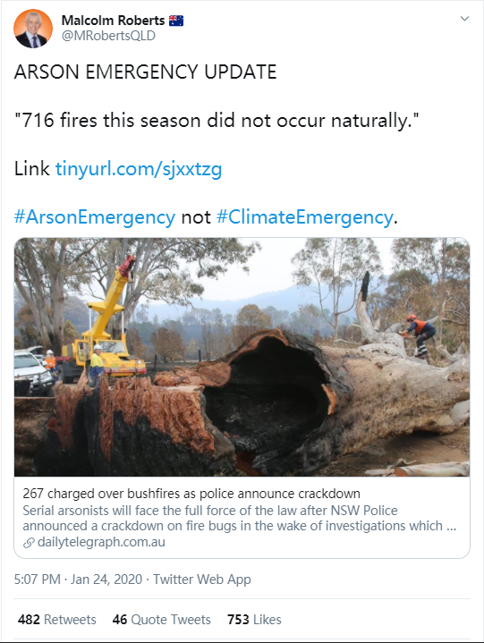

```{r setup, include=FALSE}
knitr::opts_chunk$set(echo = FALSE, message = FALSE, warning = FALSE)
library(tidyverse)
Sys.setlocale("LC_ALL","English")
```

```{r titleslide, child="components/titleslide.Rmd"}
```

---
# 🗺️ Introduction

<h2>👨‍🚒2019-2020 Australia bushfire season👩‍🚒</h2>

<div class="grid" style="grid: 1fr / 2fr 2fr;">

<div>


<br>
<br>


</div>
<div class="item">

<br>

<br>

<br>

<ul>
<li>A catastrophic and unprecedented disaster.</li>
<li>3094 houses were destroyed, 17M hectares of land burned and 33 lives were lost. </li>
</ul>
</div>


</div>


<!-- .footnote[https://www.boredpanda.com/home-destroyed-wildfire-pig-charlie/?utm_source=pinterestm&utm_medium=referral&utm_campaign=organic] -->


---
# 🗺️ Introduction


<h2>⚡  Lightning or 🔥Arson?</h2>





<!-- https://twitter.com/MRobertsQLD/status/1220588928706568193 -->
---
# 🗺️ Introduction
## 📡 Remote sensing data

**Remote sensing data** are the reflected energy from the earth collected by remote sensors carried by a satellite or an aircraft. 

Japan Aerospace Exploration Agency  provides a hotspot product taken from the **Himawari-8** satellite.

```{r}
if (!file.exists("images/hotspots_before.png")){
  library(rnaturalearth)
  library(ggthemes)
  library(lubridate)
  au_map <- ne_states(country = 'Australia', returnclass = 'sf')
  vic_map <- au_map[7,]
  VIC_hotspots_before_clustering <- read_csv("data/VIC_hotspots_before_clustering.csv")
  
  p <- ggplot(VIC_hotspots_before_clustering) +
    geom_sf(data = vic_map) +
    geom_point(aes(lon, lat), size = 3) +
    theme_map()
  
  ggsave(p, filename = "images/hotspots_before.png", height = 8, width = 12, dpi = 600)
}


```

```{r}
if (!file.exists("images/hotspots_before_summary.png")){
  p <- VIC_hotspots_before_clustering %>%
  mutate(date = as.Date("2019-10-01") + hours(time_id)) %>%
  group_by(date = floor_date(date, unit = "weeks")) %>%
  count() %>%
  ggplot() +
  geom_bar(aes(date, n), stat = "identity") +
  theme_minimal(base_size = 40) +
  ylab("Count") +
  xlab("Date") +
  ggtitle("Number of hotspots, 2019-2020")

  ggsave(p, filename = "images/hotspots_before_summary.png", height = 8, width = 12, dpi = 600)
}


```


---
class: middle center
## 🎯 Research questions

.monash-blue[(1) Can we detect **bushfire ignitions** from hotspot data?]
 
.monash-blue[(2) Can we accurately predict the **causes** of bushfires during the 2019-2020 Australia bushfire season?]

---
# 📚 Literature review

**Loboda and Csiszar (2007)**

* Fire Spread Reconstruction (**FSR**)
* Clustered hotspots in a temporal manner to detect the bushfire ignitions

**Read, Duff, and Taylor (2018)**: 


* Fitted a logistic regression generalised additive model to lightning-caused ignitions  in Victoria
* Used weather conditions, vegetation types, topographic information and environmental impact of human activities as covariates

<br>

.font_my_2[**Others**: Ester et al. (1996), Zhang, Lim, and
Sharples (2017)]
---
# 📂 Data
## .monash.blue[Data Sources]

.monash-red2[**🔥 Historical fire origins**]: .font_my_2[Department of Environment, Land, Water and Planning]

.monash-red2[**📡 Remote sensing data**]: .font_my_2[Japan Aerospace Exploration Agency]

### .monash.blue[Supplementary]

.font_my[
**Wind speed data**: .font_my_2[Commonwealth Scientific and Industrial Research Organisation and Automated Surface Observing System]

**Temperature, Rainfall and Solar exposure**:  .font_my_2[Bureau of Meteorology]

**Road map**: .font_my_2[OpenStreetMap]

**Fuel layer**: .font_my_2[Australian Bureau of Agricultural and Resource Economics]

**Fire stations and Recreation sites**: .font_my_2[Department of Environment, Land, Water and Planning]
]


---

# 📂 Data

## Remote sensing data

- How is it collected? 

Remote sensing data are the reflected energy from the earth collected by remote sensors carried by a satellite or an aircraft. 

- What kind of remote sensing data we used?

We use satellite hotspots data taken from the Himawari-8 satellite (P-Tree System, 2020). Data is available on the JAXA FTP site.


<!-- https://oceanservice.noaa.gov/facts/remotesensing.html -->
---
# Data wrangling
## Satellite hotspot data clustering

We develop a spatio-temporal clustering algorithm to track bushfires from noisy satellite hotspots data.


```{r}
if (!file.exists("images/afterclustering.jpeg")){
  library(tidyverse)
  library(ggthemes)
  library(rnaturalearth)
  library(lubridate)
  au_map <- ne_states(country = 'Australia', returnclass = 'sf')
  vic_map <- au_map[7,]
  VIC_hotspots_before_clustering <- read_csv("data/VIC_hotspots_before_clustering.csv")
  VIC_hotspots_after_clustering <- read_csv("data/VIC_hotspots_after_clustering.csv")
  hotspots <- read_csv("data/VIC_hotspots_raw.csv")
  
  VIC_hotspots_before_clustering$fire_id <- VIC_hotspots_after_clustering$fire_id
  VIC_hotspots_before_clustering$date <- hotspots$`#obstime`
  
  VIC_hotspots_after_clustering <- VIC_hotspots_before_clustering %>%
    group_by(fire_id) %>%
    summarise(time_id = min(time_id)) %>%
    left_join(VIC_hotspots_before_clustering) %>%
    group_by(fire_id, time_id) %>%
    summarise(lon = mean(lon), lat = mean(lat), date = mean(date))
  
  p <- ggplot(filter(VIC_hotspots_after_clustering, month(date) == 1)) +
    geom_sf(data = vic_map) +
    geom_point(aes(lon, lat), alpha = 0.6, size = 3) +
    theme_map(base_size = 20) +
    ggtitle("Ignitions in Victoria, January 2020")
  
  ggsave(filename = "images/afterclustering.jpeg", plot = p)
}
```


---
# Data wrangling
## Satellite hotspot data clustering

Summary of the algorithm. How it works .... All in one page. Or multiple pages depends on how many rooms I left.


---
# Other data sources

**Weather condition:**

BOM

CSRIO

ASOS

**Historical ignition data**

CFA

**Vegetation information**

Forest of Australia

**Anthropogenic factors**

Proximity to CFA, Camping site and road

etc.


---
# Data integration

How different sources and formats of data combine together. What is the final result of the compiled dataset?

Perhaps can show a snapshot of the dataset here.
---
# Explotoray data analysis

Could take up few slides, one slide for one topic.


---

# Modelling

In this research, the model building process includes 
- feature selection
- hyperparameter tuning
- candidate model selection.

Model diagnostic has also been performed on the final model.

.monash-blue[As a predictive modelling practice, we examine a spectrum of statistical models.]


**Multinomial logistic regression:** .font_small[Some def]

**GAM multinomial logistic regression:** .font_small[Some def]

**Random Forest:** .font_small[Some def]

**XGBoost:** .font_small[Some def]


---
# Feature selection

How `lime` works? Why don't we use global variable importance? How we use `lime`?

What is the feature selection result? Which variables are most important? 

---
# Hyperparameter tuning

What is the training process for each model? Which package we use to control this process?

---
# Candidate model selection

How many percentage of test data we use to perform selection?

What metrics we use to compare models?

Explain metrics.

---
# Results
## Final model

After performing feature selection and parameter tuning, we find that **random forest** is better than all other candidate models in both prediction accuracy and multi-class AUC.

<br>

```{r }
data.frame(model = c("Multinomial logistic regression", "GAM multinomial logistic regression", "Random forest", "XGBoost"), 
           accuracy = c(0.5272, 0.6583, 0.7495, 0.7388),
           auc = c(0.7424, 0.8233, 0.8795, 0.8752)) %>%
    knitr::kable("html", col.names = c("Model", "Accuracy", "Multi-class AUC"),
               label = "accandauc") %>%
  kableExtra::kable_styling(bootstrap_options = "striped")
```


---
# Results
## Model diagnostic

```{r}
data.frame(lightning = c(703, 77, 51, 44, 875), 
           accident = c(51, 494, 89, 38, 672),
           arson = c(18, 55, 174, 22, 269),
           buring_off = c(5, 8, 11, 32, 56),
           total = c(777, 634, 325, 136, 1872)) %>%
  mutate(lightning = paste0(lightning, " (", round(lightning/lightning[5]*100, 2), "%)" )) %>%
  mutate(accident = paste0(accident, " (", round(accident/accident[5]*100, 2), "%)" )) %>%
  mutate(arson = paste0(arson, " (", round(arson/arson[5]*100, 2), "%)" )) %>%
  mutate(buring_off = paste0(buring_off, " (", round(buring_off/buring_off[5]*100, 2), "%)" )) %>%
  mutate(total = paste0(total, " (", round(total/total[5]*100, 2), "%)" )) %>%
  `row.names<-`(c("predicted_lightning", "predicted_accident", "predicted_arson", "predicted_buring_off", "total")) %>%
  knitr::kable(label = "conrf") 
```

---
# Results
## Prediction


---

# Findings
## The Cause of Australia 2019-2020 bushfire

A summary statistic of the prediction. How many of them are lightning, arson, accident and burning off?

---

# Findings
## Contribution of predictors


```{r fig.width=12, fig.height=8}
  library(patchwork)
  p1 <- readRDS(file = "data/lime_ex2plot1") +
    theme_grey(base_size = 15)
  p2 <- readRDS(file = "data/lime_ex2plot2") +
    theme_grey(base_size = 15)
  p3 <- readRDS(file = "data/lime_ex2plot3") +
    theme_grey(base_size = 15)
  p4 <- readRDS(file = "data/lime_ex2plot4") +
    theme_grey(base_size = 15)
  (p1 + p2)/(p3 + p4)
```

---

# Findings
## Spatial patterns of different causes

A faceted map shows the probability of 4 different causes across Victoria using simulated data.

---
# Findings

other findings
---
# Adcanced usage

Show how our work can be used differently? Shiny app snapshot. Probability map for the risk of one type of fire ignition.


---

##Figure Source 
.font_small[
Bushfire - https://upload.wikimedia.org/wikipedia/commons/9/9a/Werombi_Bushfire.jpg

Bushfire_road - https://en.wikipedia.org/wiki/File:Bells_Line_of_Road_Bushfire_Damage_JAN2020.jpg

Bushfire_house - h<span>ttp</span>s://en.wikipedia.org/wiki/File:Home__&_Machinery_Shed_Destroyed.jpg

SF - https://user-images.githubusercontent.com/520851/34887433-ce1d130e-f7c6-11e7-83fc-d60ad4fae6bd.gif


Forest - https://www.agriculture.gov.au/abares/forestsaustralia/forest-data-maps-and-tools/spatial-data/forest-cover
]

## Major references

.font_my_2[

Bates, BC, McCaw, L, & Dowdy, AJ. (2018). Exploratory analysis of lightning-ignited wildfires in the warren region, western australia. Journal of environmental management, 225, 336–345.

Read, N, Duff, TJ, & Taylor, PG. (2018). A lightning-caused wildfire ignition forecasting model for operational use. Agricultural and Forest Meteorology, 253, 233–246

Zhang, Y, Lim, S, & Sharples, JJ. (2017). Wildfire occurrence patterns in ecoregions of new south wales and australian capital territory, australia. Natural Hazards, 87(1), 415–435.


Collins, KM, Price, OF, & Penman, TD. (2015). Spatial patterns of wildfire ignitions in south-eastern australia. International Journal of Wildland Fire, 24(8), 1098–1108.

]
---
```{r endslide, child="components/endslide.Rmd"}
```


