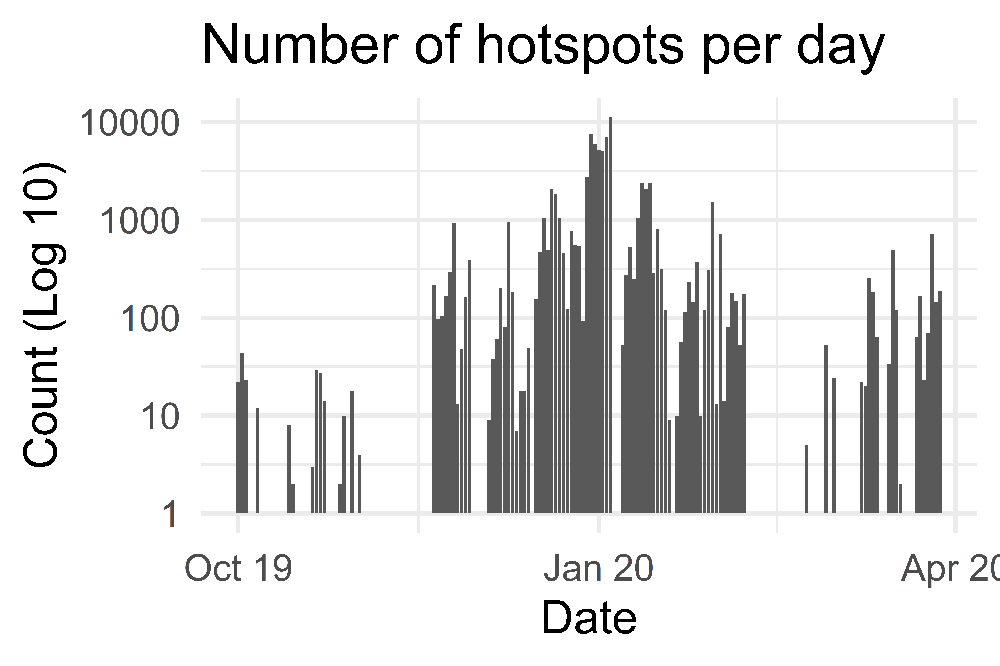

```{r setup, include=FALSE}
knitr::opts_chunk$set(echo = FALSE, message = FALSE, warning = FALSE)
library(tidyverse)
Sys.setlocale("LC_ALL","English")
```

```{r titleslide, child="components/titleslide.Rmd"}
```

---
# 🗺️ Introduction

<h2>👨‍🚒2019-2020 Australia bushfire season👩‍🚒</h2>

<div class="grid" style="grid: 1fr / 2fr 2fr;">

<div>


<br>
<br>


</div>
<div class="item">

<br>

<br>

<br>

<ul>
<li>A catastrophic and unprecedented disaster.</li>
<li>3094 houses were destroyed, 17M hectares of land burned and 33 lives were lost. </li>
</ul>
</div>


</div>


<!-- .footnote[https://www.boredpanda.com/home-destroyed-wildfire-pig-charlie/?utm_source=pinterestm&utm_medium=referral&utm_campaign=organic] -->


---
# 🗺️ Introduction


<h2>⚡  Lightning or 🔥Arson?</h2>


<!-- https://twitter.com/MRobertsQLD/status/1220588928706568193 -->
---
# 🗺️ Introduction
## 📡 Remote sensing data

**Remote sensing data** are the reflected energy from the earth collected by remote sensors carried by a satellite or an aircraft. 

Japan Aerospace Exploration Agency  provides a hotspot product taken from the **Himawari-8** satellite.

```{r}
if (!file.exists("images/hotspots_before.png")){
  library(rnaturalearth)
  library(ggthemes)
  library(lubridate)
  au_map <- ne_states(country = 'Australia', returnclass = 'sf')
  vic_map <- au_map[7,]
  VIC_hotspots_before_clustering <- read_csv("data/VIC_hotspots_before_clustering.csv")
  
  p <- ggplot(VIC_hotspots_before_clustering) +
    geom_sf(data = vic_map) +
    geom_point(aes(lon, lat), size = 3) +
    theme_map()
  
  ggsave(p, filename = "images/hotspots_before.png", height = 8, width = 12, dpi = 600)
}


```

```{r}
if (!file.exists("images/hotspots_before_summary.png")){
  library(rnaturalearth)
  library(ggthemes)
  library(lubridate)
  au_map <- ne_states(country = 'Australia', returnclass = 'sf')
  vic_map <- au_map[7,]
  VIC_hotspots_before_clustering <- read_csv("data/VIC_hotspots_before_clustering.csv")
  p <- VIC_hotspots_before_clustering %>%
  mutate(date = as.Date("2019-10-01") + hours(time_id)) %>%
  group_by(date = floor_date(date, unit = "days")) %>%
  count() %>%
  mutate(date = as.Date(date)) %>%
  ggplot() +
  geom_bar(aes(date, n), stat = "identity") +
  theme_minimal(base_size = 40) +
  ylab("Count (Log 10)") +
  xlab("Date") +
  ggtitle("Number of hotspots") +
  scale_x_date(date_labels = "%b %y") +
  scale_y_log10()

  ggsave(p, filename = "images/hotspots_before_summary.png", height = 8, width = 12, dpi = 600)
}


```





---
class: middle center
## 🎯 Research questions

.monash-blue[(1) Can we detect **bushfire ignitions** from hotspot data?]
 
.monash-blue[(2) Can we accurately predict the **causes** of bushfires during the 2019-2020 Australia bushfire season?]

---
# 📚 Literature review

**Loboda and Csiszar (2007)**

* Fire Spread Reconstruction (**FSR**)
* Clustered hotspots in a temporal manner to detect the bushfire ignitions

**Read, Duff, and Taylor (2018)**: 


* Fitted a logistic regression generalised additive model to lightning-caused ignitions  in Victoria
* Used weather conditions, vegetation types, topographic information and environmental impact of human activities as covariates

<br>

.font_my_2[**Others**: Ester et al. (1996), Zhang, Lim, and
Sharples (2017), Zumbrunnen et al. (2012)]
---
# 📂 Data
## Data Sources

.monash-red2[**🔥 Historical fire origins**]: .font_my_2[Department of Environment, Land, Water and Planning]

.monash-red2[**📡 Remote sensing data**]: .font_my_2[Japan Aerospace Exploration Agency]

### Supplementary

.font_my[
**Wind speed data**: .font_my_2[Commonwealth Scientific and Industrial Research Organisation and Automated Surface Observing System]

**Temperature, Rainfall and Solar exposure**:  .font_my_2[Bureau of Meteorology]

**Road map**: .font_my_2[OpenStreetMap]

**Fuel layer**: .font_my_2[Australian Bureau of Agricultural and Resource Economics]

**Fire stations and Recreation sites**: .font_my_2[Department of Environment, Land, Water and Planning]
]


---

# 🔬 Methodology

## Diagram


---
# 💻 Data wrangling
## Detect bushfire ignitions from hotspot data

.font_my[
We developd a spatio-temporal clustering algorithm to track bushfires from noisy satellite hotspot data.
]

--

1️⃣ Divide hotspots into different blocks
.font_my_2[
$$[max(t-24, 1), t], t = 1,2,...,T~(hours)$$
]

--

2️⃣ Cluster hotspots in each block

.font_my_2[
* Connect two nodes if geodesic between two nodes <= 3km.
* A connected component is a cluster.
]

--

3️⃣ Update the clustering results recursively

.font_my_2[
* Start from the second hour, till the end.
* If a hotspot is also in the last hour block, update its membership. And then hotspots who share the component with it will also be updated.
]

--

4️⃣ Compute ignition locations

---
# 💻 Data wrangling
## Clustering result

```{r}
if (!file.exists("images/hotspots_after.png")){
  library(rnaturalearth)
  library(ggthemes)
  library(lubridate)
  au_map <- ne_states(country = 'Australia', returnclass = 'sf')
  vic_map <- au_map[7,]
  VIC_hotspots_before_clustering <- read_csv("data/VIC_hotspots_before_clustering.csv")
  VIC_hotspots_after_clustering <- read_csv("data/VIC_hotspots_after_clustering.csv")
  hotspots <- read_csv("data/VIC_hotspots_raw.csv")
  
  VIC_hotspots_before_clustering$fire_id <- VIC_hotspots_after_clustering$fire_id
  VIC_hotspots_before_clustering$date <- hotspots$`#obstime`
  
  VIC_hotspots_after_clustering <- VIC_hotspots_before_clustering %>%
    group_by(fire_id) %>%
    summarise(time_id = min(time_id)) %>%
    left_join(VIC_hotspots_before_clustering) %>%
    group_by(fire_id, time_id) %>%
    summarise(lon = mean(lon), lat = mean(lat), date = mean(date))
  
  p <- ggplot(VIC_hotspots_after_clustering) +
    geom_sf(data = vic_map) +
    geom_point(aes(lon, lat), alpha = 0.8, size = 2) +
    theme_map()
  
  ggsave(p, filename = "images/hotspots_after.png", height = 7, width = 12, dpi = 600) 
}

```


<!--  -->

---
# 💻 Data wrangling
## Clustering result

```{r}
if (!file.exists("images/hotspots_after_summary.png")){
  library(rnaturalearth)
  library(ggthemes)
  library(lubridate)
  au_map <- ne_states(country = 'Australia', returnclass = 'sf')
  vic_map <- au_map[7,]
  VIC_hotspots_before_clustering <- read_csv("data/VIC_hotspots_before_clustering.csv")
  VIC_hotspots_after_clustering <- read_csv("data/VIC_hotspots_after_clustering.csv")
  hotspots <- read_csv("data/VIC_hotspots_raw.csv")
  
  VIC_hotspots_before_clustering$fire_id <- VIC_hotspots_after_clustering$fire_id
  VIC_hotspots_before_clustering$date <- hotspots$`#obstime`
  
  VIC_hotspots_after_clustering <- VIC_hotspots_before_clustering %>%
    group_by(fire_id) %>%
    summarise(time_id = min(time_id)) %>%
    left_join(VIC_hotspots_before_clustering) %>%
    group_by(fire_id, time_id) %>%
    summarise(lon = mean(lon), lat = mean(lat), date = mean(date))
  
  VIC_hotspots_before_clustering %>%
  mutate(date = as.Date("2019-10-01") + hours(time_id)) %>%
  group_by(date = floor_date(date, unit = "days")) %>%
  count() %>%
  ungroup() %>%
  mutate(state = "Number of hotspots") %>%
  bind_rows(VIC_hotspots_after_clustering %>%
    group_by(date = floor_date(date, unit = "days")) %>%
    count() %>%
    ungroup() %>%
    mutate(state = "Number of bushfire ignitions")) %>%
    mutate(date = as.Date(date)) %>%
    
    ggplot() +
    geom_bar(aes(date, n), stat = "identity") +
    facet_wrap(~fct_relevel(state, "Number of hotspots"), ncol = 1) +
    scale_y_log10() +
    theme_minimal(base_size = 30) +
    xlab("Date") +
    ylab("Count (Log 10)") +
    scale_x_date(date_labels = "%b %y")-> p
  
  ggsave(p, filename = "images/hotspots_after_summary.png", height = 7, width = 12, dpi = 600) 
}
```


---
# 💻 Data wrangling
## Data integration

.font_my[
🚀 Used **`raster`** to extract values in **Grid** format data by projecting the bushfire ignitions on the grid:] 

.font_my_2[
  - Forest type, forest height class, forest crown cover and average daily wind speed
]

<br>

--

.font_my[
🚀 Used **`sf`** to calculate the geodesic in **Simple features GIS** data for every bushfire ignition: ]

.font_my_2[
  - Proximity to the nearest CFA station, the nearest camping site and the nearest road
]

<br>

--

.font_my[
🚀 Used **`tidyverse`** to summarize the weather statistics:]

.font_my_2[
  - Temperature, rainfall, solar exposure and wind speed
  - 1-day average, 7-day average, 14-day average, 28-day average, ..., 720-day average
]

---
# 📊 Explotoray data analysis 

## Overview of historical bushfire ignitions

```{r}
if (!file.exists("images/ignition_summary.png")){
  library(tidyverse)
library(lubridate)
library(ggthemes)
library(rnaturalearth)
au_map <- ne_states(country = 'Australia', returnclass = 'sf')
vic_map <- au_map[7,]

set.seed(357)

# Read in training data
training <- read_csv("data/training.csv")

training <- training %>%
  filter(!CAUSE %in% c("BURNING BUILDING",
                       "WASTE DISPOSAL, INDUSTRIAL, SAWMILL, TIP",
                       "WASTE DISPOSAL, DOMESTIC",
                       "BURNING VEHICLE, MACHINE",
                       "BURNING BUILDING")) %>%
  filter(new_cause != "other") %>%
  filter(new_cause != "relight")


training <- select(training, -c(EVENTID:FIRE_NUM), -id, -CAUSE, -FOREST, -FOR_CODE, -FOR_CAT)

training <- mutate(training,
                   year = factor(year(FIRE_START)),
                   month = factor(month(FIRE_START), levels = c(10,11,12,1,2,3)),
                   day = factor(day(FIRE_START), levels = c(1:31)),
                   wod = factor(wday(FIRE_START), levels = c(1:7)))

training <- filter(training, month %in% c(10,11,12,1,2,3))


training <- na.omit(training)

training <- mutate(training, new_cause = ifelse(new_cause == "accidental_human", "accident", new_cause)) %>%
  mutate(new_cause = ifelse(new_cause == "burning_off_human", "burning_off", new_cause)) %>%
  mutate(new_cause = factor(new_cause)) %>%
  mutate(FOR_TYPE = factor(FOR_TYPE))

training <- na.omit(training)

training <- mutate(training,
                   log_dist_cfa = log(dist_cfa),
                   log_dist_camp = log(dist_camp),
                   log_dist_road = log(dist_road),
                   COVER = factor(COVER),
                   HEIGHT = factor(HEIGHT))

training <- rename(training, cause = new_cause)
training <- mutate(training,
                   cause = fct_relevel(cause,
                                       "lightning",
                                       "accident",
                                       "arson",
                                       "burning_off"))

training <- na.omit(training)

  training %>%
  mutate(cause = factor(tools::toTitleCase(as.character(cause)), levels = c("Lightning", "Accident", "Arson", "Burning_off"))) %>%
    ggplot() +
     geom_histogram(aes(cause), stat = "count") +
    theme_minimal(base_size = 20) +
    ggtitle("Histogram of causes") +
    xlab("Cause") +
    ylab("Count") -> p
  
  ggsave(p, filename = "images/ignition_summary.png", height = 4, width = 8, dpi = 600)
}
  
```

.font_my_2[
Lightning and accident were the two main sources of historical bushfire ignitions, which took up 41% and 34% respectively. There were 17% bushfires caused by arson.
]


---
# 📊 Explotoray data analysis 

## Spatial distribution of historical ignitions

```{r}
if (!file.exists("images/density.png")){
  library(tidyverse)
library(lubridate)
library(ggthemes)
library(rnaturalearth)
au_map <- ne_states(country = 'Australia', returnclass = 'sf')
vic_map <- au_map[7,]

set.seed(357)

# Read in training data
training <- read_csv("data/training.csv")

training <- training %>%
  filter(!CAUSE %in% c("BURNING BUILDING",
                       "WASTE DISPOSAL, INDUSTRIAL, SAWMILL, TIP",
                       "WASTE DISPOSAL, DOMESTIC",
                       "BURNING VEHICLE, MACHINE",
                       "BURNING BUILDING")) %>%
  filter(new_cause != "other") %>%
  filter(new_cause != "relight")


training <- select(training, -c(EVENTID:FIRE_NUM), -id, -CAUSE, -FOREST, -FOR_CODE, -FOR_CAT)

training <- mutate(training,
                   year = factor(year(FIRE_START)),
                   month = factor(month(FIRE_START), levels = c(10,11,12,1,2,3)),
                   day = factor(day(FIRE_START), levels = c(1:31)),
                   wod = factor(wday(FIRE_START), levels = c(1:7)))

training <- filter(training, month %in% c(10,11,12,1,2,3))


training <- na.omit(training)

training <- mutate(training, new_cause = ifelse(new_cause == "accidental_human", "accident", new_cause)) %>%
  mutate(new_cause = ifelse(new_cause == "burning_off_human", "burning_off", new_cause)) %>%
  mutate(new_cause = factor(new_cause)) %>%
  mutate(FOR_TYPE = factor(FOR_TYPE))

training <- na.omit(training)

training <- mutate(training,
                   log_dist_cfa = log(dist_cfa),
                   log_dist_camp = log(dist_camp),
                   log_dist_road = log(dist_road),
                   COVER = factor(COVER),
                   HEIGHT = factor(HEIGHT))

training <- rename(training, cause = new_cause)
training <- mutate(training,
                   cause = fct_relevel(cause,
                                       "lightning",
                                       "accident",
                                       "arson",
                                       "burning_off"))

training <- na.omit(training)

  training %>%
  mutate(cause = factor(tools::toTitleCase(as.character(cause)), levels = c("Lightning", "Accident", "Arson", "Burning_off"))) %>%
  ggplot() +
      geom_density_2d_filled(aes(lon, lat), contour_var = "ndensity") +
      geom_sf(data = vic_map, fill = NA, col = "white") +
      facet_wrap(~cause)+
      ggtitle("2D conditional density plot of historical bushfire ignitions") +
    theme_map(base_size = 20) +
    theme(legend.position = "right",
          plot.margin = unit(c(0, 0, 0, 0), "pt")) +
    guides(fill = guide_legend(reverse = T)) -> p
  
  ggsave(p, filename = "images/density.png", height = 6, width = 12, dpi = 1200)
}


    
```

.font_my_2[
Lightning-caused bushfires were mostly in the east of Victoria. Bushfires caused by arson were near Bendigo.
]


---
# 📊 Explotoray data analysis 

## Proximity

```{r}
if (!file.exists("images/density_cfa.png")){
    library(tidyverse)
library(lubridate)
library(ggthemes)
library(rnaturalearth)
au_map <- ne_states(country = 'Australia', returnclass = 'sf')
vic_map <- au_map[7,]

set.seed(357)

# Read in training data
training <- read_csv("data/training.csv")

training <- training %>%
  filter(!CAUSE %in% c("BURNING BUILDING",
                       "WASTE DISPOSAL, INDUSTRIAL, SAWMILL, TIP",
                       "WASTE DISPOSAL, DOMESTIC",
                       "BURNING VEHICLE, MACHINE",
                       "BURNING BUILDING")) %>%
  filter(new_cause != "other") %>%
  filter(new_cause != "relight")


training <- select(training, -c(EVENTID:FIRE_NUM), -id, -CAUSE, -FOREST, -FOR_CODE, -FOR_CAT)

training <- mutate(training,
                   year = factor(year(FIRE_START)),
                   month = factor(month(FIRE_START), levels = c(10,11,12,1,2,3)),
                   day = factor(day(FIRE_START), levels = c(1:31)),
                   wod = factor(wday(FIRE_START), levels = c(1:7)))

training <- filter(training, month %in% c(10,11,12,1,2,3))


training <- na.omit(training)

training <- mutate(training, new_cause = ifelse(new_cause == "accidental_human", "accident", new_cause)) %>%
  mutate(new_cause = ifelse(new_cause == "burning_off_human", "burning_off", new_cause)) %>%
  mutate(new_cause = factor(new_cause)) %>%
  mutate(FOR_TYPE = factor(FOR_TYPE))

training <- na.omit(training)

training <- mutate(training,
                   log_dist_cfa = log(dist_cfa),
                   log_dist_camp = log(dist_camp),
                   log_dist_road = log(dist_road),
                   COVER = factor(COVER),
                   HEIGHT = factor(HEIGHT))

training <- rename(training, cause = new_cause)
training <- mutate(training,
                   cause = fct_relevel(cause,
                                       "lightning",
                                       "accident",
                                       "arson",
                                       "burning_off"))

training <- na.omit(training)

  training %>%
  mutate(cause = factor(tools::toTitleCase(as.character(cause)), levels = c("Lightning", "Accident", "Arson", "Burning_off"))) %>%
    gather(key = "metric", value = "distance", log_dist_cfa, log_dist_road) %>%
    mutate(metric = ifelse(metric == "log_dist_cfa", "Log distance to the nearest CFA station", "Log distance to the nearest road")) %>%
    ggplot() +
    geom_density(aes(distance, col = cause), size = 1.5) +
    theme_minimal(base_size = 20) +
    theme(legend.position = "bottom") +
    xlab("Log distance") +
    scale_color_brewer(palette = "RdBu") +
    facet_wrap(~metric, scales = "free_x") -> p
  
  ggsave(p, filename = "images/density_cfa.png", height = 6, width = 12, dpi = 600)
  
}
```

.font_my_2[
Lightning-caused bushfires were far away from the CFA station and road which made it less reachable. In contrast, bushfires caused by arson were close to CFA station and road.
]


---
# 📐 Modelling

.monash-blue[We used a **random forest** model to classify different causes of bushfire ignition. ]


.font_my_2[
**Random forest** (Breiman, 2001) is an ensemble learning method for building tree-based prediction models. It generates a certain number of decision trees by using the bootstrap aggregating technique and take the majority vote in the case of decision trees as the prediction.
]

.monash-blue[.font_my[We kept 80% of the data as training set, which was 7497 observations. And the remaining 1872 observations was used as test set.]]

<br>

.font_my_2[
Other candidate models were also tested, but their performance was worse than random forest. ]

```{r}
library(kableExtra)
data.frame(model = c("Multinomial logistic regression", "GAM multinomial logistic regression", "Random forest", "XGBoost"), 
           Accuracy = c(0.5272, 0.6779, 0.7495, 0.7388),
           AUC = c(0.7424, 0.8233, 0.8795, 0.8752)) %>%
  `colnames<-`(c("Model", "Accuracy", "Muti-class AUC")) %>%
  knitr::kable("html")  %>%
  kable_classic(full_width = F, html_font = "Cambria") %>%
  kable_styling(font_size = 20)
```


---

# 📐 Modelling

# Feature selection

.font_my_2[
We needed to select the most important features out of 55, but the global variable importance could be bias and misleading.]

.font_my[
We used **`lime`**  
- Assumes machine learning models are linear at the local scope
]

.font_my[

1️⃣ Randomly sample data points around an given observation

2️⃣ Pass sample data points to the model to obtain predictions

3️⃣ Fit a lasso regression on the predictions with the sample data points

4️⃣ Select the most important variables from the regularization path

5️⃣ repeat 1️⃣-4️⃣ for 100 observations. Variables being selected most frequently are most important . We kept the top 10 most important variables.
]

---
# 📐 Modelling
## Model performance

.font_my[
.monash-blue[The overall accuracy of our model was 74.95%.] 

- Lightning-caused and accident-caused ignitions could be easily classified from other causes.  
- The model was not very confident with arson and burning off. 
]

<br>

```{r}
data.frame(Lightning = c(703, 51, 18, 5, 777), 
           Accident = c(77, 494, 55, 8, 634),
           Arson = c(50, 89, 175, 11, 325),
           Burning_off = c(44, 38, 22, 32, 136),
           Total = c(874, 672, 270, 56, 1872)) %>%
  mutate(Lightning = c(paste0(Lightning[1:4], " (", round(Lightning[1:4]/Lightning[5]*100, 1), "%)" ), paste0(Lightning[5]))) %>%
  mutate(Accident = c(paste0(Accident[1:4], " (", round(Accident[1:4]/Accident[5]*100, 1), "%)" ), paste0(Accident[5]))) %>%
  mutate(Arson = c(paste0(Arson[1:4], " (", round(Arson[1:4]/Arson[5]*100, 1), "%)" ), paste0(Arson[5]))) %>%
  mutate(Burning_off = c(paste0(Burning_off[1:4], " (", round(Burning_off[1:4]/Burning_off[5]*100, 1), "%)" ), paste0(Burning_off[5]))) %>%
  `row.names<-`(c("Prediction:Lightning", "Prediction:Accident", "Prediction:Arson", "Prediction:Buring_off", "Total")) %>%
  knitr::kable("html")  %>%
  kable_classic(full_width = F, html_font = "Cambria") %>%
  kable_styling(font_size = 20)
  
```

---
# 📐 Modelling
## Model diagnostic

```{r}
if (!file.exists("images/error.png")){
library(caret)
library(lubridate)
library(tidyverse)
library(ggthemes)
  set.seed(10086)
  
  # Read in training data
  training <- read_csv("data/training.csv")
  
  training <- training %>%
    filter(!CAUSE %in% c("BURNING BUILDING",
                         "WASTE DISPOSAL, INDUSTRIAL, SAWMILL, TIP",
                         "WASTE DISPOSAL, DOMESTIC",
                         "BURNING VEHICLE, MACHINE",
                         "BURNING BUILDING")) %>%
    filter(new_cause != "other") %>%
    filter(new_cause != "relight")
  
  
  training <- select(training, -c(EVENTID:FIRE_NUM), -id, -CAUSE, -FOREST, -FOR_CODE, -FOR_CAT)
  
  training <- mutate(training,
                     year = factor(year(FIRE_START)),
                     month = factor(month(FIRE_START), levels = c(10,11,12,1,2,3)),
                     day = factor(day(FIRE_START), levels = c(1:31)),
                     wod = factor(wday(FIRE_START), levels = c(1:7)))
  
  training <- filter(training, month %in% c(10,11,12,1,2,3))
  
  training <- na.omit(training)
  
  training <- mutate(training, new_cause = ifelse(new_cause == "accidental_human", "accident", new_cause)) %>%
    mutate(new_cause = ifelse(new_cause == "burning_off_human", "burning_off", new_cause)) %>%
    mutate(new_cause = factor(new_cause)) %>%
    mutate(FOR_TYPE = factor(FOR_TYPE))
  
  training <- na.omit(training)
  
  training <- mutate(training,
                     log_dist_cfa = log(dist_cfa),
                     log_dist_camp = log(dist_camp),
                     log_dist_road = log(dist_road),
                     COVER = factor(COVER),
                     HEIGHT = factor(HEIGHT))
  
  training <- rename(training, cause = new_cause)
  training <- mutate(training,
                     cause = fct_relevel(cause,
                                         "lightning",
                                         "accident",
                                         "arson",
                                         "burning_off"))
  
  training <- na.omit(training)
  
  training <- select(training, -year, -dist_road, -dist_cfa, -dist_camp, -FIRE_START)
  
  inTraining <- createDataPartition(training$cause, p = .8, list = FALSE)[,1]
  train_set <- training[inTraining,]
  test_set  <- training[-inTraining,]
  
  rf_model <- readRDS("data/RF_model.rds")

  
  test_set$error <- predict(rf_model, newdata = test_set) != test_set$cause
  
library(sf)
library(rnaturalearth)
au_map <- ne_states(country = 'Australia', returnclass = 'sf')
vic_map <- au_map[7,]

lat <- seq(34, 39, 0.5)
lat <- -lat
lon <- seq(141, 150, 0.5)

grids <- expand.grid(lat, lon)


rect <- function(x){

  # left top
  lat1 <- x[1]
  lon1 <- x[2]

  # right top
  lat2 <- x[1]
  lon2 <- x[2]+0.5

  # right bottom
  lat3 <- x[1]-0.5
  lon3 <- x[2]+0.5

  # left bottom
  lat4 <- x[1]-0.5
  lon4 <- x[2]

  st_sfc(st_polygon(list(matrix(c(lon1,lat1,lon2,lat2,lon3,lat3,lon4,lat4,lon1,lat1), ncol =2, byrow = TRUE))))

}

rect_list <- apply(grids[1:nrow(grids),],1,rect)

rect_list <- do.call(c, rect_list)

st_crs(rect_list) <- 4326

indexes <- st_intersects(vic_map$geometry, rect_list)[[1]]
rect_list <- rect_list[indexes]

test_set2 <- st_as_sf(filter(test_set, error), coords = c("lon", "lat"), crs = 4326)
test_set3 <- st_as_sf(test_set, coords = c("lon", "lat"), crs = 4326)

temp <- unlist(lapply(st_intersects(rect_list, test_set3), length))
temp <- ifelse(temp <= 4, NA, temp) 


as.data.frame(rect_list) %>%
  mutate(error = unlist(lapply(st_intersects(rect_list, test_set2), length))/temp) %>%
  mutate(error = ifelse(is.nan(error), NA, error)) %>%
  na.omit() %>%
  ggplot() +
  geom_sf(aes(geometry = geometry, fill = error)) +
  geom_sf(data = vic_map, fill = NA, col = "black") +
  scale_fill_distiller(palette = "Reds", direction = 1, limits = c(0,1)) +
  theme_map(base_size = 20) +
  theme(legend.position = "right") +
  labs(fill = "Error rate") -> p

ggsave(p, filename = "images/error.png", height = 6, width = 12, dpi = 900)
}
```

.font_my_2[
Our model correctly predicted most of the cases in the east of Victoria. However, it performed worse near Melbourne. Besides, our model didn’t fit well in the north-west of Victoria.
]


---
# 📐 Modelling
## Model interpretation

```{r}
if (!file.exists("images/varimp.png")){
  
   explaination <- readRDS("data/lime_ex2")
  
  name_dict <- list("log_dist_camp" = "Log distance to the nearest camping site",
       "log_dist_cfa" = "Log distance to the nearest CFA station",
       "log_dist_road" = "Log distance to the nearest road",
       "lon" = "longitude",
       "lat" = "Latitude",
       "ase180" = "Average solar exposure in the past 180 days",
       "arf360" = "Average rainfall in the past 360 days",
       "ase90" = "Average solar exposure in the past 90 days",
       "aws_m24" = "Average wind speed in the past 24 months",
       "aws_m12" = "Average wind speed in the past 12 months")
  
  
  explaination %>%
  mutate(label = factor(tools::toTitleCase(label), levels = c("Lightning", "Accident", "Arson", "Burning_off"))) %>%
    mutate(feature = unlist(name_dict[feature])) %>%
  ggplot() +
    geom_boxplot(aes(feature_weight, feature), outlier.size = 0.5) +
    geom_vline(xintercept = 0, col = "red") +
    ylab("feature") +
    facet_wrap(~label, ncol = 2) +
    xlab("Feature Weight") +
    ylab("Feature") +
    theme_minimal(base_size = 20) -> p
  ggsave(p, filename = "images/varimp.png", height = 6, width = 12, dpi = 600)
}

 
  
```

.font_my_2[
The feature weights can be seen as the marginal effects. They were the scaled coefficients of the lasso regression produced by **`lime`**. Proximity to the nearest road, proximity to the nearest road and average wind speed had a significant impact on the prediction.
]

<!-- shows proximity to the nearest CFA station and proximity to the nearest road have a -->
<!-- high positive impact on the probability of lightning-caused bushfire, while average wind -->
<!-- speed in the last 2 years has a high negative impact on the probability. Patterns in arson -->
<!-- are almost the opposite of what has been shown in lightning. Latitude and average wind -->
<!-- speed in past 24 months have some positive impact on the probability of accident-caused -->
<!-- bushfire, while average wind speed in past 12 months, proximity to the nearest road -->
<!-- and proximity to the nearest camping site have negative to the probability. Variable -->
<!-- contribution to the probability of planned burn is relatively small, and the proximity to -->
<!-- the nearest CFA station and latitude contribute negatively to the probability. -->


---

# 🔎 Results
.font_my[ **Prediction of the causes of 2019-2020 Australia bushfires**]


```{r out.width="100%"}
library(ggthemes)
library(rnaturalearth)
library(lubridate)
au_map <- ne_states(country = 'Australia', returnclass = 'sf')
vic_map <- au_map[7,]

read_csv("data/prediction_2019-2020.csv") %>%
  mutate(cause = factor(tools::toTitleCase(cause), levels = c("Lightning", "Accident", "Arson", "Burning_off"))) %>%
  ggplot() +
  geom_sf(data = vic_map, fill = "white") +
  geom_point(aes(lon, lat, col = cause, text = paste0("Mon: ", month.abb[month(time)])), size = 1.5, alpha = 1) +
  theme_map(base_size = 20) +
  theme(legend.position = "right") +
  # facet_wrap(~factor(month.abb[month(time)], levels = c("Oct", "Nov", "Dec", "Jan", "Feb", "Mar"))) +
  scale_color_brewer(palette = "RdBu")-> p

library(plotly)


ggplotly(p, tooltip = c("colour", "text"))

```


---

# 🔎 Results
## Summary of the predictions

.font_my_2[
.monash-blue[- Most majority of the bushfires in 2019-2020 season were caused by **lightning**.]
- 138 bushfires caused by accidents which took up 14% of the total fires. Most of them were ignited in March. 
- 37 bushfires were caused by arsonists, and over half of them were in March.
- Very few planned burns were predicted after October 2019 which suggests the correctness of our model.
]

<br>

```{r}
read_csv("data/prediction_2019-2020.csv") %>%
  mutate(cause = factor(tools::toTitleCase(cause), levels = c("Lightning", "Accident", "Arson", "Burning_off"))) %>%
  mutate(month = factor(month.abb[month(time)], levels = c("Oct", "Nov", "Dec", "Jan", "Feb", "Mar"))) %>%
  group_by(cause, month) %>%
  count() %>%
  ungroup() %>%
  rename(Cause = cause) %>%
  spread(month, n) -> temp

temp[is.na(temp)] <- 0

temp$Total <- temp$Oct + temp$Nov + temp$Dec + temp$Jan + temp$Feb + temp$Mar
temp$Total <- paste0(temp$Total, " (", round(temp$Total/sum(temp$Total), 2), "%)")

temp  %>%
  knitr::kable("html")  %>%
  kable_classic(full_width = F, html_font = "Cambria") %>%
  kable_styling(font_size = 20)
  
```


---
# 🔎 Results
## Spatial characteristics of different causes

```{r out.width="100%"}
if (FALSE){
  library(sf)
lat <- seq(34, 39, 0.2)
lat <- -lat
lon <- seq(141, 150, 0.2)

grids <- expand.grid(lat, lon)


rect <- function(x){

  # left top
  lat1 <- x[1]
  lon1 <- x[2]

  # right top
  lat2 <- x[1]
  lon2 <- x[2]+0.2

  # right bottom
  lat3 <- x[1]-0.2
  lon3 <- x[2]+0.2

  # left bottom
  lat4 <- x[1]-0.2
  lon4 <- x[2]

  st_sfc(st_polygon(list(matrix(c(lon1,lat1,lon2,lat2,lon3,lat3,lon4,lat4,lon1,lat1), ncol =2, byrow = TRUE))))

}

rect_list <- apply(grids[1:nrow(grids),],1,rect)

rect_list <- do.call(c, rect_list)

st_crs(rect_list) <- 4326

indexes <- st_intersects(vic_map$geometry, rect_list)[[1]]
rect_list <- rect_list[indexes]


sim <- read_csv("data/prediction_2019-2020_simulation.csv")

sim2 <- st_as_sf(sim, coords = c("lon", "lat"), crs = 4326)


rect_index <- st_intersects(rect_list, sim2)

sim$rect <- 0
for (i in 1:length(indexes)){
  sim$rect[rect_index[[i]]] <- i
}

rect_list <- as.data.frame(rect_list)
rect_list <- mutate(rect_list, rect = 1:nrow(rect_list))


temp <- sim %>%
  group_by(rect, month, cause) %>%
  summarise(count = n()) %>%
  ungroup() %>%
  spread(cause, count)

temp[is.na(temp)] <- 0
  
rect_list <- temp %>%
  right_join(rect_list, by = c("rect"))

rect_list <- rect_list %>%
  gather(key = "cause", value = "count", lightning, accident, arson, burning_off) %>%
  mutate(cause = factor(tools::toTitleCase(cause), levels = c("Lightning", "Accident", "Arson", "Burning_off")))

ggplot() +
  geom_sf(data = rect_list, aes(fill = count/10, geometry = geometry), col = NA) +
  facet_grid(cause~factor(month.abb[month], levels = c("Oct", "Nov", "Dec", "Jan", "Feb", "Mar"))) +
  scale_fill_distiller(palette = "Reds", direction = 1, limits = c(0,1)) +
  theme_map(base_size = 15) +
    theme(legend.position = "right",
          plot.margin = unit(c(0, 0, 0, 0), "pt")) +
  labs(fill = "Probability") +
  ggtitle("Probability of the new ignition is caused by")-> p

ggsave(p, filename = "images/promap.png", height = 7, width = 12, dpi = 1200, device = png())
}
```

.font_my_2[ This map is based on the assumption that the long-run weather condition of the new ignition is similar to 2019-2020 Australia bushfire season. ]


---
# 📜 Discussion
## Policy implication

.font_my[
- May need to consider delivering planned burns on a larger scale in remote areas of Victoria in an earlier date to reduce the risk of lightning-ignited bushfire.
- May need to reveal the motivations behind the rose of the number of accident-caused bushfire in March 2020 to reduce the controllable impact on bushfire ignition.
- Time to investigate if there is any disinformation campaign behind the spread of the controversial argument given arson is unlikely to be the main cause.
]

---
# 📜 Contributions
## Summary

1. Algorithm to detect bushfire ignition from hotspot data
2. Model to predict the cause of bushfire ignition
3. Prediction of the causes of the 2019-2020 Australia bushfires
4. A complete and adaptable workflow for monitoring and understanding new ignition from hotspot data

---
#❓ Extension
## Risk of bushfire ignited by different methods

Using the lightning-ignited bushfire as an example, our model only produced $$P(L|S,\mathcal{F})$$
where $L$ = the bushfire ignited by lightning, $S$ = the bushfire ignited and $\mathcal{F}$ is other information of the ignition, such as location, time, weather conditions, etc.

A future extension would be predicting $P(S|\mathcal{F})$ and combining this model to produce

$$P(L,S|\mathcal{F}) = P(L|S,\mathcal{F})P(S|\mathcal{F})$$
---
class: middle center
## 🙋‍♂️ Thanks for listening!

.monash-blue[I would like to thank my supervisors, 

**Dianne Cook** and **Emily Dodwell**, 

for your help and guidance.  ]

<br>

.monash-blue[I would also thank **Xueyan Zhao** and **Heather Anderson** for your coordination in this year.]


 

---
## Figure Source 
.font_small[
Bushfire - https://upload.wikimedia.org/wikipedia/commons/9/9a/Werombi_Bushfire.jpg

Bushfire_2 - https://www.boredpanda.com/home-destroyed-wildfire-pig-charlie/?utm_source=pinterestm&utm_medium=referral&utm_campaign=organic
]

## Major references

.font_my_2[

Ester, M, HP Kriegel, J Sander, X Xu, et al. (1996). A density-based algorithm for discovering clusters in large spatial databases with noise. In: Kdd. Vol. 96. 34, pp.226–
231.

Loboda, T and I Csiszar (2007). Reconstruction of fire spread within wildland fire events
in Northern Eurasia from the MODIS active fire product. Global and Planetary Change
56(3-4), 258–273.

Read, N, Duff, TJ, & Taylor, PG. (2018). A lightning-caused wildfire ignition forecasting model for operational use. Agricultural and Forest Meteorology, 253, 233–246

Zhang, Y, Lim, S, & Sharples, JJ. (2017). Wildfire occurrence patterns in ecoregions of new south wales and australian capital territory, australia. Natural Hazards, 87(1), 415–435.

Zumbrunnen, T, P Menéndez, H Bugmann, M Conedera, U Gimmi, and M Bürgi (2012).
Human impacts on fire occurrence: a case study of hundred years of forest fires in a
dry alpine valley in Switzerland. Regional Environmental Change 12(4), 935–949.

]
---
```{r endslide, child="components/endslide.Rmd"}
```


